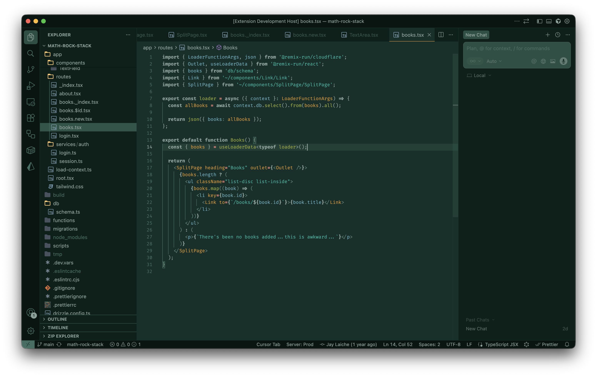

# Field Research

A dark VSCode theme.



## Installation

### From VS Code Marketplace

1. Open VS Code
2. Go to Extensions (`Cmd+Shift+X` on macOS, `Ctrl+Shift+X` on Windows/Linux)
3. Search for "Field Research"
4. Click Install
5. Open Command Palette (`Cmd+Shift+P` / `Ctrl+Shift+P`)
6. Type "Color Theme" and select **Preferences: Color Theme**
7. Choose **Field Research**

### From Command Line

```bash
code --install-extension LA1CH3.field-research
```

### Manual Installation

Download the `.vsix` file from the [releases page](https://github.com/LA1CH3/field-research/releases) and install via:

```bash
code --install-extension field-research-0.1.0.vsix
```

---

## About

Inspirations:

- [YouTube videos of remote forest outpost ambience](https://www.youtube.com/watch?v=GGw3axV7IGs&list=RDGGw3axV7IGs&start_radio=1)
- [Casette futurism](https://www.reddit.com/r/cassettefuturism/)
- [Solarized](https://ethanschoonover.com/solarized/)

Built on Solarized's principle of perceptual uniformity: all accent colors are normalized to **L\* ≈ 65** in CIELAB, ensuring no single hue dominates visually. Keywords use weight (bold) rather than a separate hue, reducing chromatic noise.

---

## Base Tones

Background and foreground tones derived from the editor background hue (≈163° teal). These create the structural scaffold of the UI.

| Name       | Role                                | Hex       | RGB             |  L\* |   a\* |  b\* |
| ---------- | ----------------------------------- | --------- | --------------- | ---: | ----: | ---: |
| bg-darkest | Title bar, activity bar, status bar | `#071512` | `7, 21, 18`     |  5.6 |  -5.3 | +0.2 |
| bg-darker  | Sidebar, inactive tabs              | `#0a1f1a` | `10, 31, 26`    |  9.9 | -10.0 | +0.8 |
| bg         | Editor background                   | `#103029` | `16, 48, 41`    | 17.4 | -13.9 | +0.9 |
| base01     | Gutter, line numbers                | `#2a5548` | `42, 85, 72`    | 32.8 | -18.6 | +3.0 |
| base00     | Inactive icons, disabled text       | `#3d6e62` | `61, 110, 98`   | 42.8 | -19.8 | +1.5 |
| base0      | Secondary labels, breadcrumbs       | `#5a877a` | `90, 135, 122`  | 52.8 | -18.4 | +2.1 |
| base1      | Editor foreground, keywords (bold)  | `#88a099` | `136, 160, 153` | 63.9 |  -9.8 | +0.8 |

---

## Accent Colors

Syntax highlighting and semantic UI accents. All normalized to L\* ≈ 65 for perceptual uniformity.

| Name   | Role                         | Hex       | RGB             |  L\* |   a\* |   b\* |
| ------ | ---------------------------- | --------- | --------------- | ---: | ----: | ----: |
| yellow | Functions, methods           | `#94a731` | `148, 167, 49`  | 65.1 | -22.5 | +55.7 |
| orange | Classes, constants           | `#d29123` | `210, 145, 35`  | 65.0 | +15.9 | +62.7 |
| rose   | Numbers                      | `#cd8d91` | `205, 141, 145` | 65.0 | +24.9 |  +7.8 |
| red    | Operators, special functions | `#e78175` | `231, 129, 117` | 64.9 | +37.9 | +23.9 |
| blue   | Variables, properties        | `#5ea9b6` | `94, 169, 182`  | 65.1 | -19.8 | -13.9 |
| cyan   | Strings                      | `#00b3a0` | `0, 179, 160`   | 65.6 | -42.5 |  -1.1 |
| green  | Comments                     | `#00b573` | `0, 181, 115`   | 65.2 | -54.5 | +23.0 |

---

## Syntax Mapping

| Scope                                                      | Color  | Style    | Hex       |
| ---------------------------------------------------------- | ------ | -------- | --------- |
| Keywords (`if`, `else`, `return`, `import`, `class`, etc.) | base1  | **bold** | `#88a099` |
| Functions, method names                                    | yellow | normal   | `#94a731` |
| Strings, string interpolation                              | cyan   | normal   | `#00b3a0` |
| Numbers, booleans                                          | rose   | normal   | `#cd8d91` |
| Classes, types, constants                                  | orange | normal   | `#d29123` |
| Variables, properties, parameters                          | blue   | normal   | `#5ea9b6` |
| Operators, punctuation                                     | red    | normal   | `#e78175` |
| Comments                                                   | green  | normal   | `#00b573` |
| Default text, brackets                                     | base1  | normal   | `#88a099` |

---

## UI Accent Usage

| Element                | Color        | Value       |
| ---------------------- | ------------ | ----------- |
| Active tab border      | orange       | `#d29123`   |
| Text selection         | base00 @ 50% | `#3d6e6280` |
| Find match highlight   | orange @ 33% | `#d2912355` |
| Current line highlight | base00 @ 25% | `#3d6e6240` |
| Button background      | green        | `#00b573`   |
| Button foreground      | bg-darkest   | `#071512`   |
| Borders (chrome)       | bg (editor)  | `#103029`   |
| Links, info messages   | blue         | `#5ea9b6`   |
| Git: added             | green        | `#00b573`   |
| Git: modified          | orange       | `#d29123`   |
| Git: deleted           | red          | `#e78175`   |
| Errors                 | red          | `#e78175`   |
| Warnings               | orange       | `#d29123`   |
